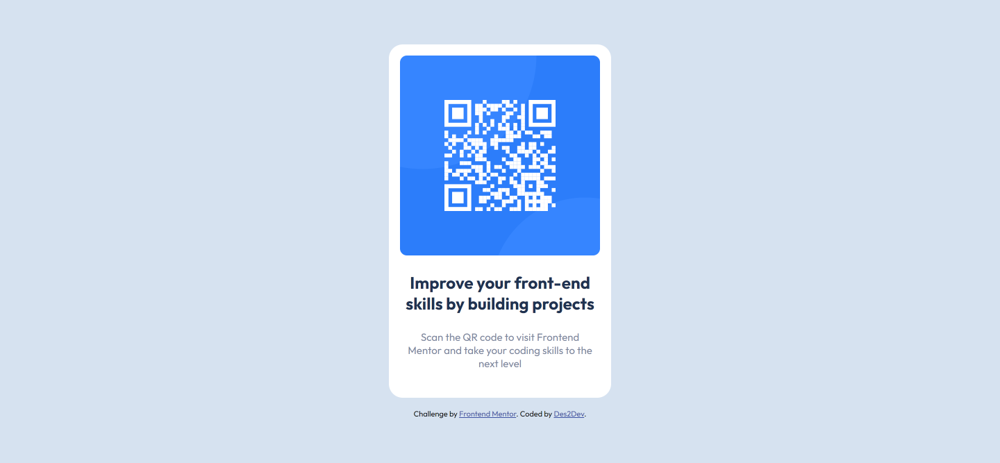

# Frontend Mentor - QR code component solution

This is a solution to the [QR code component challenge on Frontend Mentor](https://www.frontendmentor.io/challenges/qr-code-component-iux_sIO_H). Frontend Mentor challenges help you improve your coding skills by building realistic projects.

## Table of contents

1. [Frontend Mentor - QR code component solution](#frontend-mentor---qr-code-component-solution)
   1. [Table of contents](#table-of-contents)
   2. [Overview](#overview)
      1. [The Challenge](#the-challenge)
      2. [Screenshot](#screenshot)
      3. [Links](#links)
   3. [My process](#my-process)
      1. [Built with](#built-with)
      2. [Useful resources](#useful-resources)
   4. [Author](#author)

## Overview

### The Challenge

- My challenge is to build out this QR code component and get it looking as close to the design as possible.

### Screenshot

### Links

- Solution URL: [Add solution URL here](https://www.frontendmentor.io/solutions/mobilefirst-card-component-solution-using-css-flexbox-F-PmGQRUf3)
- Live Site URL: [Add live site URL here](https://des2dev.github.io/QR-card-component/)

## My process

### Built with

- Semantic HTML5 markup
- CSS custom properties
- Flexbox
- Mobile-first workflow

### Useful resources

- [Flexbox](https://developer.mozilla.org/en-US/docs/Web/CSS/CSS_Flexible_Box_Layout/Basic_Concepts_of_Flexbox)
- [CSS custom properties](https://developer.mozilla.org/en-US/docs/Web/CSS/Using_CSS_custom_properties)

## Author

- Frontend Mentor - [@Des2Dev](https://www.frontendmentor.io/profile/yourusername)
